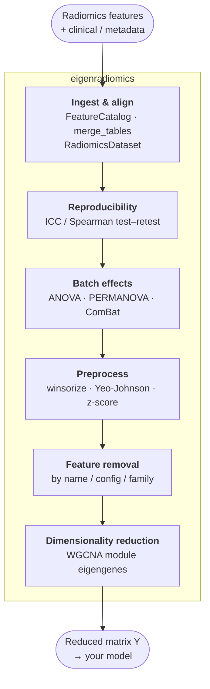

# Welcome to eigenradiomics

[](https://github.com/martonkolossvary/eigenradiomics/actions/workflows/ci.yml)
[](https://martonkolossvary.github.io/eigenradiomics/)
[](https://pypi.org/project/eigenradiomics/)
[](https://pypi.org/project/eigenradiomics/)
[](https://pypi.org/project/eigenradiomics/)
[](https://github.com/martonkolossvary/eigenradiomics/blob/main/LICENSE)
[](https://codecov.io/gh/martonkolossvary/eigenradiomics)
[](https://github.com/astral-sh/ruff)
[](https://mypy-lang.org/)

{ align=right width=180 }

**eigenradiomics** is a modular, scikit-learn-compatible toolkit for the whole
**pre-analysis** of wide feature matrices — with an initial focus on radiomics
tables such as the outputs produced by
[Pictologics](https://github.com/martonkolossvary/pictologics). It takes you
from raw feature + clinical tables, through reliability and batch-effect
screening, preprocessing, and feature reduction, to a clean matrix ready for
modeling — every step composable inside an `sklearn.pipeline.Pipeline`.

The package is built around a simple contract: reduce a wide feature matrix
\(X \in \mathbb{R}^{n \times m}\) to a compact representation
\(Y \in \mathbb{R}^{n \times k}\) with \(k \ll m\), where \(n\) is the number of
samples. Each reducer learns its mapping (factors, clusters, loadings) from the
training data only and stores it, so the same transformation can later be
applied deterministically to new, unseen samples without re-fitting — avoiding
leakage between cohorts.

## The pre-analysis workflow



eigenradiomics owns the shaded steps; the raw tables come from your extractor
and the final model is yours. Each step is a normal scikit-learn transformer or
a small utility, so you can use one piece in isolation or chain the whole thing.

## What's in the box

| Stage | Utility | What it does |
|-------|---------|--------------|
| Ingest & align | [`FeatureCatalog`, `merge_tables`, `RadiomicsDataset`](user_guide/data_ingestion.md) | Load, clean, and join radiomics + clinical into one validated, role-aware table |
| Reproducibility | [`compute_reproducibility`](user_guide/reproducibility.md) | ICC(2,1) and Spearman/Pearson test–retest reliability, with reports & plots |
| Batch effects | [`compute_batch_effects`](user_guide/batch_effects.md) | Center/scanner effect diagnostics (ANOVA, PERMANOVA) + ComBat sensitivity |
| Preprocess | [`RadiomicsPrepTransformer`](user_guide/radiomics_preprocessing.md) | NaN-aware winsorize → Yeo-Johnson → z-score, per feature |
| Select | [`RadiomicsFeatureRemover`, `FeatureScoreSelector`](user_guide/radiomics_preprocessing.md) | Drop columns by name/config/family, or by a QC score (e.g. low ICC) |
| Harmonize | [`ComBatHarmonizer`](user_guide/harmonization.md) | Leakage-safe ComBat batch correction (fit on train, apply to test) |
| Reduce | [`WGCNAReducer`](reducers/wgcna.md) | Co-expression module eigengenes with leakage-safe transform of new data |
| Visualize | [`plot_clustered_heatmap`](user_guide/clustered_heatmap.md) | The cornerstone clustered heatmap with annotation tracks + correlation panel |
| Downstream stats | [`compute_module_trait_associations`](user_guide/downstream_analysis.md) | Module-eigengene ↔ trait correlations with p-values and FDR |

## Why eigenradiomics?

- **🧩 Modular framework**: Add new dimensionality-reduction methods without changing the pipeline architecture.
- **⚙️ Scikit-learn-native**: Works out of the box with `sklearn.pipeline.Pipeline`, `GridSearchCV`, and cross-validation; every parameter is exposed for tuning.
- **🛡️ Safe handling of wide tables**: Validates DataFrame feature names and order across `fit` and `transform`, so column misalignment is caught instead of silently producing wrong results.
- **📊 Publication-ready diagnostics**: Every analysis step ships formatted Excel reports and accessible figures (see the [Reproducibility](user_guide/reproducibility.md) and [Batch Effects](user_guide/batch_effects.md) guides).
- **🚀 Reproducible by design**: A fitted reducer maps new data deterministically, giving identical outputs across runs and evaluation splits.

## A 30-second taste

```python
import pandas as pd
from sklearn.pipeline import Pipeline
from eigenradiomics import RadiomicsPrepTransformer, RadiomicsFeatureRemover, WGCNAReducer

X = pd.read_csv("radiomics_features.csv")

pipe = Pipeline([
    ("drop_shape", RadiomicsFeatureRemover(families="shape", catalog="catalog.csv")),
    ("prep", RadiomicsPrepTransformer()),                 # winsor → Yeo-Johnson → z-score
    ("reduce", WGCNAReducer(soft_power="auto", min_module_size=30)),
])

Y = pipe.fit_transform(X)        # wide table -> a handful of module eigengenes
print(Y.shape)                   # (n_samples, n_modules), columns wgcna_0, wgcna_1, ...
```

!!! tip "New here?"
    Start with the [Quick Start](user_guide/quick_start.md), then read
    [Data Ingestion & Datasets](user_guide/data_ingestion.md) to see how raw
    tables become a clean, role-aware matrix.

## Documentation Map

The docs follow a [Diátaxis](https://diataxis.fr/) layout:

- **Tutorials** — learn by doing: [Quick Start](user_guide/quick_start.md) and the
  full [End-to-End Workflow](user_guide/end_to_end.md) (every primitive wired into one pipeline).
- **How-to Guides** — task recipes: [load & align](user_guide/data_ingestion.md),
  [reproducibility](user_guide/reproducibility.md), [batch effects](user_guide/batch_effects.md),
  [preprocess](user_guide/radiomics_preprocessing.md), [reduce](reducers/wgcna.md),
  [visualize](user_guide/clustered_heatmap.md), [downstream statistics](user_guide/downstream_analysis.md),
  and [pipelines & tuning](user_guide/pipelines_and_grid_search.md).
- **Explanation** — understand the design: [best practices & pitfalls](user_guide/best_practices.md),
  the [input data model](user_guide/input_data_model.md), and the [reducer contract](reducers/index.md).
- **Reference** — look it up: the [API reference](api/package.md).
