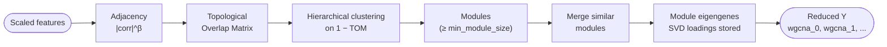
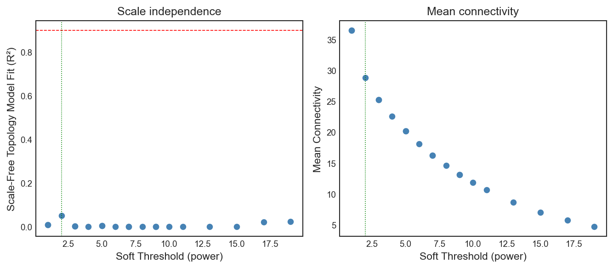
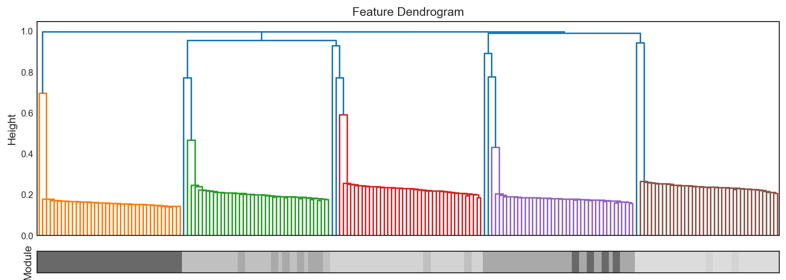

# WGCNA Reducer (Weighted Gene Co-expression Network Analysis)

`WGCNAReducer` is an unsupervised reducer, originally developed for gene-expression data and built on the `PyWGCNA` backend. It groups tightly correlated features into modules and represents each module by a single summary variable (its eigengene), turning a very wide feature matrix into a small set of module-level components. The fitted loadings are stored so the same mapping can be applied to new data.



The steps below map one-to-one onto this flow.

## Mathematical Formulation

Unlike global factorization methods such as Principal Component Analysis, which decompose variance across all features at once, WGCNA works bottom-up: it builds a feature-to-feature similarity network and derives modules from its structure.

### 1. Adjacency Matrix

Initial variable clusters are extracted by estimating continuous topological distances between inputs across the feature plane. A power function soft-thresholds the Pearson correlation metric \(\text{corr}(x_i, x_j)\), driving weak connections toward zero and enhancing significant overlaps asymptotically.

\[
A_{ij} = \lvert \text{corr}(x_{i}, x_{j}) \rvert ^ {\beta}
\]

Where \(\beta\) (`soft_power`) represents the scaling amplification factor maximizing scale-free topological dependencies. 

### 2. Topological Overlap Matrix (TOM)

To theoretically protect clustering boundaries against localized noise spikes, the Adjacency mapping transfers to evaluating shared neighbourhood dependencies via the Topological Overlap Matrix.

\[
\text{TOM}_{ij} = \frac{\sum_u A_{iu} \cdot A_{uj} + A_{ij}}{\min(K_i, K_j) + 1 - A_{ij}}
\]

Dissimilarity matrices are constructed as \(1 - \text{TOM}_{ij}\). Hierarchical clustering is then applied to this dissimilarity, iteratively grouping the most tightly connected features into modules (bounded by `min_module_size`).

### 3. Latent Vector Mapping (Module Eigengenes)

Each module is summarized by one or more components so the reduction can be applied consistently to new data.

Every identified module represents a cluster of highly correlated features. Traditionally, each module is represented by a single Module Eigengene ($Y_{\text{mod}}$), which is the first principal component (PC1) derived via Singular Value Decomposition (SVD) across the centered and scaled features belonging **only** to that module.

To capture more complex variation (especially when the first principal component explains only a fraction of the total module variance), the framework supports extracting the top $k$ principal components per module using the `n_module_components` parameter:

\[
X^{(\text{scaled})} = U \Sigma V^T
\]

For each module, we compute and store the loading matrix $V_{1..k}$ containing the top $k$ singular vectors:

\[
Y_{\text{mod}} = X^{(\text{scaled})} \cdot V_{1..k}
\]

* **If $k = 1$**: The loading is a 1-D vector $V_1 \in \mathbb{R}^{d}$, and $Y_{\text{mod}} \in \mathbb{R}^{n \times 1}$.
* **If $k > 1$**: The loading is a 2-D matrix $V_{1..k} \in \mathbb{R}^{d \times k}$, and $Y_{\text{mod}} \in \mathbb{R}^{n \times k}$.

The loading weights are stored during `.fit()` and reused during `.transform()` to project unseen data deterministically without re-running the clustering. This is also the basis for `.inverse_transform()`, which reconstructs an approximation of the original feature space from the reduced representation using the transpose of the loading matrix ($Y_{\text{mod}} \cdot V_{1..k}^T$).

---

## Python Interface

The number of output columns equals the total number of module components discovered during `fit` (one per module by default, or `n_module_components` per module).

### Training Execution

```python
from eigenradiomics import WGCNAReducer

reducer = WGCNAReducer(
    soft_power="auto",
    min_module_size=30,    # minimum number of features per module
    me_diss_threshold=0.2, # merge modules whose eigengene dissimilarity is below this
    deep_split=2,          # tree-cut sensitivity (0-4)
)

Y_train = reducer.fit_transform(X_train)
```

### Projecting Unseen Data (No Leakage)

`transform` reuses the loadings learned during `fit`, so new samples are projected through the same mapping and no information leaks from the training set.

```python
# Project new samples using only the fitted model:
Y_test = reducer.transform(X_test)

# Approximately reconstruct the original features from the reduced space:
X_reconstructed = reducer.inverse_transform(Y_test)
```

---

## Diagnostics

The reducer exposes helper methods to inspect the fitted model:

- `wgcna_get_module_assignments()` — features assigned to each module
- `wgcna_get_module_sizes()` — number of features per module
- `wgcna_get_feature_importances()` — per-feature SVD loadings within each module
- `wgcna_get_soft_power_table()` — scale-free topology table (when `soft_power="auto"`)
- `wgcna_plot_soft_power()` — soft-power diagnostic plot
- `wgcna_plot_dendrogram()` — feature dendrogram with module colour bar

### Plots

The soft-power plot shows the scale-free topology fit (R²) and mean connectivity across candidate powers, with the selected power marked:

```python
fig = reducer.wgcna_plot_soft_power(figsize=(10, 5))
fig.savefig("soft_power.png", dpi=150)
```



!!! tip "Reading the soft-power plot"
    Pick the lowest power whose R² (left panel) crosses the dashed
    `r_squared_cut` line while mean connectivity (right panel) is still
    reasonable. `soft_power="auto"` does this for you; the plot lets you sanity-
    check the choice or pick an explicit integer for fully deterministic runs.

The dendrogram plot shows the hierarchical clustering of features, with a colour bar indicating each feature's module assignment:

```python
fig = reducer.wgcna_plot_dendrogram(figsize=(12, 4))
fig.savefig("dendrogram.png", dpi=150)
```



Each coloured branch is a module of co-expressed features; the bar beneath maps
every leaf to its module. Unassigned features form the "grey" module and are
dropped unless `include_grey=True`.

## Parameter Guide

| Parameter | Default | Guidance |
|-----------|---------|----------|
| `network_type` | `"signed hybrid"` | How correlations are turned into adjacencies: `"signed hybrid"`, `"signed"`, or `"unsigned"`. Signed variants keep the direction of correlation. |
| `tom_type` | `"signed"` | Topological Overlap Matrix type: `"signed"` or `"unsigned"`. |
| `soft_power` | `"auto"` | Soft-thresholding power $\beta$ for the adjacency matrix. `"auto"` selects a value via scale-free topology fit; an integer fixes it for fully deterministic pipelines. |
| `r_squared_cut` | `0.9` | Target R² for scale-free topology when `soft_power="auto"`. Lower it if automatic selection fails to reach the threshold. |
| `mean_cut` | `100` | Mean-connectivity ceiling used during automatic soft-power selection. |
| `min_module_size` | `50` | Minimum number of features per module. Smaller values yield more, finer modules; depends on the matrix width. |
| `me_diss_threshold` | `0.2` | Module-eigengene dissimilarity threshold for merging similar modules (0–1). |
| `deep_split` | `2` | `cutreeHybrid` sensitivity (0–4); higher splits the dendrogram more aggressively into smaller modules. |
| `pam_respect_dendro` | `False` | Whether the PAM stage of `cutreeHybrid` respects the dendrogram. |
| `include_grey` | `False` | If `True`, keep unassigned ("grey") features as an extra pseudo-module; if `False` (default), they are excluded from the output. |
| `store_tom` | `False` | Keep the Topological Overlap Matrix as `tom_`. Memory-intensive (O(n²)). |
| `n_module_components` | `1` | Number of principal components (eigengenes) to extract per module. Setting $k > 1$ captures richer intra-module variation. |
| `n_jobs` | `None` | Number of parallel jobs for per-module SVD and projection. `None`/`1` is sequential; `-1` uses all CPU cores. |
| `verbose` | `0` | `0` suppresses PyWGCNA stdout; `>= 1` passes it through. |
| `log_file` | `None` | If set, redirect PyWGCNA stdout to this file instead of the console. |

## References

- Langfelder, P., & Horvath, S. (2008). **WGCNA: an R package for weighted correlation network analysis**. *BMC Bioinformatics*, 9, 559. [PubMed](https://pubmed.ncbi.nlm.nih.gov/19114008/)
- Rezaie, N., et al. (2023). **PyWGCNA: A Python package for weighted gene co-expression network analysis**. *Bioinformatics*, 39(7). [PubMed](https://pubmed.ncbi.nlm.nih.gov/37399090/)

