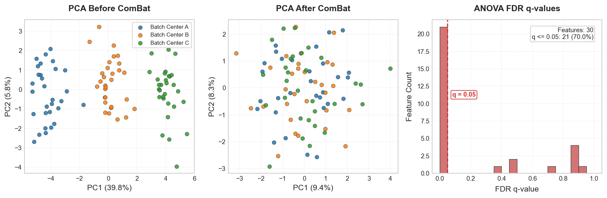

# Center-Associated Batch Effects Diagnostics

Radiomics features extracted from medical images are notoriously sensitive to variation in scanner manufacturer, imaging protocols, reconstruction kernels, and slice thicknesses. These variations introduce non-biological variations (batch effects) that can severely confound predictive models, leading to models that learn to classify scanners rather than clinical pathology.

`eigenradiomics` provides a batch-effect diagnostics framework to identify and evaluate scanner/center-associated batch effects and to check how sensitive results are to ComBat correction. It covers preprocessing, per-feature tests, multivariate global diagnostics, a ComBat sensitivity check, and Excel + figure reports.

For clean statistics the feature distributions are first normalised with
`RadiomicsPrepTransformer` (NaN-aware winsorize → Yeo-Johnson → z-score). The
ANOVA and its effect size are computed on that transformed matrix, while the
rank-based Kruskal-Wallis and the Levene variance test use the raw matrix. You
can supply your own prep configuration via the `pipeline=` argument (see
[Pipeline integration](#pipeline-and-preprocessing-integration) below); for the
transformer itself, see [Preprocess feature tables](radiomics_preprocessing.md).

---

## Feature-Level Statistical Tests

The framework computes detailed feature-level diagnostics, choosing the input matrix to match each test's assumptions:
* **ANOVA F-statistic and $\eta^2$** — computed on the **preprocessed/transformed** features, where the test's normality assumption is more reasonable. Parametric test assessing the difference in feature means across centers; $\eta^2$ is the proportion of variance explained by center association.
* **Kruskal-Wallis H-statistic and $\epsilon^2$** — computed on the **raw** features. Non-parametric analog of ANOVA, robust to skewed non-normal distributions, so it is applied directly to the untransformed values.
* **Brown-Forsythe/Levene test** — computed on the **raw** features. Assesses heteroscedasticity (inequality of variance) across centers.
* **FDR q-values**: Corrects all $p$-values using the Benjamini-Hochberg false discovery rate procedure.

---

## Multivariate Global Diagnostics

To understand the global impact of batch effects across the entire radiomics feature space, the framework computes:
* **Principal Component Analysis (PCA)**: Project features into low-dimensional orthogonal space. We report the explained variance ratio of PC1 and PC2.
* **Silhouette Score**: Evaluates cluster separation of centers in the PCA subspace. A higher positive score ($> 0.1$) implies strong clustering by center (severe batch effect).
* **PERMANOVA Pseudo-F test**: A non-parametric permutation-based MANOVA test (using Euclidean distance, 999 permutation steps, and a hardcoded random seed of `42` to guarantee perfect reproducibility). A significant p-value ($p < 0.05$) indicates that centers/scanners occupy statistically distinct regions of the feature space.

---

## ComBat Correction Sensitivity Check

If the optional `inmoose` library (or `combat` extra) is installed, the framework automatically performs a **ComBat sensitivity diagnostic**. It runs parametric/non-parametric ComBat adjustment and re-evaluates all feature-level and global diagnostics to show exactly how much center-associated variance remains after correction.

This is a *diagnostic*, not a correction. When it confirms a real batch effect, apply it leakage-safely with [`ComBatHarmonizer`](harmonization.md) (fit on train, transform test).

```bash
# To install the optional ComBat dependency:
pip install eigenradiomics[combat]
```

---

## End-to-End Diagnostics Example

Evaluate center-associated batch effects on a wide-format radiomics DataFrame:

```python
import pandas as pd
from eigenradiomics import compute_batch_effects, write_batch_effects_excel, plot_batch_effects

# 1. Load radiomics features and center batch labels
X = pd.read_csv("features.csv", index_col="PatientID")
batch = pd.read_csv("centers.csv", index_col="PatientID")["CenterID"]

# 2. Run the diagnostics pipeline
results = compute_batch_effects(
    X,
    batch,
    permutations=999,      # more permutations -> finer p-value resolution
    no_combat=False        # Perform ComBat sensitivity check
)

# 3. View the global diagnostics summary
print(results["global_diagnostics"])

# 4. View detailed feature-level tests
print(results["feature_stats"].head())
```

---

## Excel Reports & Figures

### Multi-Sheet Excel Reports

Export the complete diagnostics suite to a formatted Excel file with auto-filters
and frozen headers on every sheet, styled header rows, auto-fit columns, and
decimal formatting (3 d.p. for coefficients, 4 d.p./scientific notation for
p-values):

```python
write_batch_effects_excel(results, "batch_effects_report.xlsx")
```

### Accessible Figures

Generate high-contrast figures with accessible (colourblind-safe, sans-serif) styling:

```python
fig = plot_batch_effects(
    results,
    path="batch_effects_visuals.png",
    primary_alpha=0.05
)
```

The panels make the batch effect and its correction visually obvious: samples
separate by center along PC1 *before* ComBat and mix *after*, while the q-value
histogram quantifies how many features differ significantly across centers:



!!! note "ComBat here is a sensitivity check, not a default"
    `compute_batch_effects` reports how much center-associated variance *would*
    remain after ComBat; it does not silently harmonize your features. Use the
    diagnostics to decide whether harmonization is warranted, then apply it
    deliberately.

**Accessibility Rules Applied**:
* **Colorblind-Friendly Palettes**: High-contrast colors representing different centers.
* **Contrast Outlines**: Scatter points and histogram bins are framed with dark boundaries (`edgecolor='0.25'`) to maintain a contrast ratio $> 3:1$.
* **No Redundant Legends**: The ANOVA FDR q-value histogram uses direct text annotations to label the primary alpha cut line instead of using separate color boxes.
* **Clear Typography**: Sized perfectly in sans-serif fonts for comfortable readability.

---

## Pipeline and Preprocessing Integration

You can define a custom scikit-learn preprocessing pipeline, pass it directly to `compute_batch_effects`, and then reuse the exact same preprocessing parameters in your downstream model:

```python
from sklearn.pipeline import Pipeline
from eigenradiomics.preprocessing import RadiomicsPrepTransformer, RadiomicsFeatureRemover

# 1. Define your standard preprocessing configuration
prep_pipeline = RadiomicsPrepTransformer(
    winsor_lower=0.05,
    winsor_upper=0.95,
    skip_yeo_johnson=False
)

# 2. Diagnose batch effects using your exact pipeline settings
results = compute_batch_effects(
    X,
    batch,
    pipeline=prep_pipeline,
    no_combat=False
)

# 3. Inspect which features failed QC or show severe batch effects
qc_failed = results["feature_qc"][~results["feature_qc"]["keep"]]["feature"].tolist()

# 4. Construct downstream machine learning model using the same prep steps
model_pipeline = Pipeline([
    ("qc_filter", RadiomicsFeatureRemover(features=qc_failed)),
    ("prep", prep_pipeline),
    # ... classifier, feature reducer, etc.
])
```
