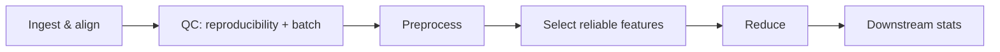

# Best Practices & Pitfalls

A consolidated checklist for using eigenradiomics correctly end-to-end. Each item
links to the guide with the details.

## Workflow order

The steps are designed to run in this order; doing them out of order is the most
common source of trouble.

1. **Ingest and align first** with [`from_pictologics`](data_ingestion.md#loading-a-pictologics-export) / `merge_tables`, so features and metadata stay index-aligned for everything downstream.
2. **Screen before you model.** Run [reproducibility](reproducibility.md) and [batch-effect](batch_effects.md) QC on the *raw* features — both need information (multiple readers, batch labels) that does not exist inside a single-`X` fit.
3. **Preprocess, then reduce.** Always scale (`RadiomicsPrepTransformer`) *before* `WGCNAReducer`: the network is built on correlations, and an unscaled feature can dominate. Keep them in one `Pipeline`.

## Leakage safety

- **Fit on train only.** Every transformer learns its mapping in `fit` and replays it in `transform`. Inside cross-validation, put the *whole* pipeline (including the reducer) in the splitter so the reduction is fit per fold — never `fit_transform` the full cohort first.
- **Group by patient.** Use `dataset.groups` with `GroupKFold` so repeated scans of one patient don't straddle train/test. See [Downstream Analysis](downstream_analysis.md#feeding-eigengenes-into-a-model-leakage-safe-cv).
- **Keep labels through the pipeline.** Call `.set_output(transform="pandas")` so eigengenes keep their sample index and `wgcna_*` names for joining to traits/outcomes.

## Feature identity

- **Prefer DataFrames.** Name-based steps (`RadiomicsFeatureRemover`, `FeatureScoreSelector`, catalog selectors) need column names. Fitting on a DataFrame and transforming an equivalent array is supported (it warns), but a DataFrame end-to-end is safest.
- **The `config__feature_key` convention** is assumed throughout. For observer-paired reproducibility tables (`O1_…`, `O2_…`), pass `observer_prefixes` to `RadiomicsFeatureRemover` and use [`split_observer_tables`](data_ingestion.md#loading-a-pictologics-export).

## QC choices

- **ICC threshold.** ≥ 0.80 is a common "good reliability" cut; judge from the ICC estimate **and its CI vs the threshold**, not the p-value (the ICC p-value only tests whether subjects differ). Drop weak features with [`FeatureScoreSelector`](downstream_analysis.md#qc-driven-feature-selection-in-a-pipeline).
- **Bootstrap CIs need samples.** ICC CIs from only a handful of subjects are unreliable regardless of iterations.
- **ComBat is a sensitivity check, not a default.** `compute_batch_effects` reports how much a result *would* change under ComBat; only harmonize when a real, non-biological batch effect is shown — and do it leakage-safely (fit correction on train).

## Reduction

- **`soft_power="auto"`** picks the threshold from the scale-free fit; inspect `wgcna_plot_soft_power()` if modules look off.
- **`min_module_size`** controls granularity; too large yields all-grey (no modules → a `(n, 0)` output, with a warning). Lower it or set `include_grey=True`.
- **Constant features** can't enter the network (they're left unassigned with a warning) — drop them upstream.

## Figures

- The defaults are **colourblind-safe and greyscale-legible** (magma, RdBu_r, Okabe-Ito), verified under a deuteranopia simulation. Beyond **eight** categorical levels the strip palette falls back to `tab20`, which is **not** safe — keep ≤ 8 categories or pass explicit colours. See the [Clustered Heatmap](clustered_heatmap.md#accessibility) guide.

## Performance

- **Nested parallelism.** If a reducer's `n_jobs > 1` runs inside a `GridSearchCV`/`cross_validate` that is *also* parallel, you can oversubscribe cores. Parallelize at one level. See [Scalability](scalability.md).
- **Pre-filter wide tables.** WGCNA builds an \(O(m^2)\) similarity matrix; remove clearly-irrelevant features (by family, or by QC score) before reducing thousands of columns.
