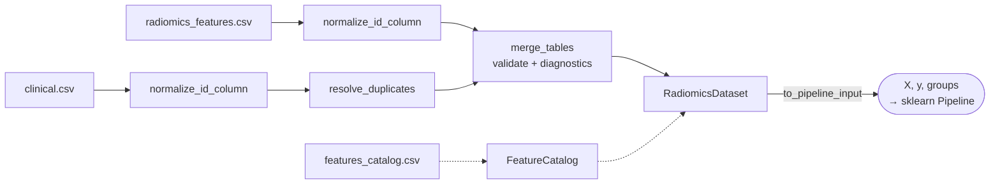

# Data Ingestion & Datasets

Before any analysis you need a clean `n_samples x n_features` matrix aligned with
its metadata (identifiers, center/batch, clinical covariates, outcomes).
eigenradiomics provides study-agnostic primitives for that entry point, plus a
container that keeps features and metadata together as they flow through
scikit-learn pipelines.



Every box below is a single function or class; you can use them piecemeal or
chain them into the flow above.

## Loading a Pictologics export

Features extracted with [Pictologics](https://github.com/martonkolossvary/pictologics)
arrive as a wide table with `{config}__{feature_key}` columns and a sidecar
`features_catalog.csv`. `RadiomicsDataset.from_pictologics` loads them in one call
— it auto-discovers the sidecar catalog next to the table, drops the `subject_id`
columns Pictologics emits, detects the feature columns, validates them against the
catalog (warning on any mismatch), and splits features from metadata:

```python
from eigenradiomics import RadiomicsDataset

# `features.csv` + `features_catalog.csv` produced by Pictologics, in the same folder
dataset = RadiomicsDataset.from_pictologics(
    "features.csv",                 # a DataFrame works too
    group="PatientID", batch="Center", target="outcome",
)
```

**Reproducibility (observer-paired) tables.** Two-reader studies pivot the table
into `{observer}_{config}__{feature_key}` columns (e.g. `O1_…`, `O2_…`).
`split_observer_tables` reshapes that into one feature matrix per observer, ready
for [`compute_reproducibility`](reproducibility.md); and `RadiomicsFeatureRemover`
takes `observer_prefixes` so `families=`/`configs=` selectors and catalog joins
still resolve on the base feature name:

```python
from eigenradiomics import split_observer_tables, compute_reproducibility

readers = split_observer_tables(paired_table, ("O1_", "O2_"), id_columns="PatientID")
results = compute_reproducibility(readers)
```

## The feature catalog

Pictologics-style tables name feature columns `{config}__{feature_key}` and ship
a sidecar catalog with one row per feature. `FeatureCatalog` turns that table
into a first-class object used for annotation, validation, and grouping:

```python
from eigenradiomics import FeatureCatalog

catalog = FeatureCatalog.from_csv("features_catalog.csv")
catalog.feature_names        # ['original__Energy', 'original__Entropy', ...]
catalog.families()           # ['firstorder', 'glcm', ...]

# Check that a table's feature columns are all known (raises if not)
catalog.validate(feature_columns)

# Left-join catalog metadata onto a results table keyed by feature name
annotated = catalog.annotate(results_df)   # adds config/feature_key/family/...
```

A legacy single `feature` column containing `config__feature_key` values is also
accepted.

## Aligning radiomics with clinical data

The three ingestion primitives make the join explicit and auditable, so silent
misalignment cannot occur.

```python
import pandas as pd
from eigenradiomics import normalize_id_column, resolve_duplicates, merge_tables

radiomics = pd.read_csv("radiomics_features.csv")
clinical = pd.read_csv("clinical.csv")

# 1. Normalize identifiers (strip/collapse whitespace, blank-like -> missing)
clinical, changes = normalize_id_column(clinical, "PatientID")
radiomics, _ = normalize_id_column(radiomics, "PatientID")

# 2. Resolve duplicate clinical rows (e.g. keep the earliest procedure)
clinical, dropped = resolve_duplicates(
    clinical, key="PatientID", policy="min", order_column="procedure_date"
)

# 3. Merge with cardinality validation and mismatch diagnostics
result = merge_tables(
    radiomics, clinical,
    left_on="PatientID", right_on="PatientID",
    how="left", validate="one_to_one",
)
merged = result.merged
result.left_only     # radiomics rows with no clinical match
result.right_only    # clinical rows with no radiomics match
result.n_matched     # number of matched keys
```

`resolve_duplicates` supports `policy` values `"error"` (default), `"first"`,
`"last"`, `"most_complete"` (most non-missing values), and `"min"` / `"max"`
(by `order_column`). `merge_tables` accepts any pandas `how` and the
`validate` cardinality checks (`"one_to_one"`, `"one_to_many"`, ...), and it
computes the unmatched-key diagnostics independently of `how` so you always see
both sides.

## Carrying features and metadata together

`RadiomicsDataset` wraps the merged table, separating feature columns from
metadata and recording **study-design roles** (which column is the patient
group, the batch, the survival endpoint, etc.). It then hands a clean feature
matrix to a pipeline while keeping groups and targets available for splitters
and models.

```python
from eigenradiomics import RadiomicsDataset

ds = RadiomicsDataset.from_wide(
    merged,
    catalog=catalog,        # used to identify feature columns (or auto-detect "__")
    group="PatientID",      # for leakage-safe grouped cross-validation
    batch="Center",         # for batch-effect analysis
    time="fu_years",        # survival duration
    event="death",          # survival event
)

ds.features        # DataFrame of feature columns only (the X for sklearn)
ds.metadata        # the non-feature columns
ds.groups          # patient-id array for GroupKFold
X, y = ds.to_pipeline_input()   # y is [time, event] here
```

Feature columns are inferred from the catalog when given, otherwise from the
`__` naming convention; you can also pass `feature_columns` explicitly. Extra
roles (`observer`, `phase`, `timepoint`, `mask`, ...) can be supplied via
`roles={...}` and read back from `ds.design.roles`.

### Why this matters for pipelines

scikit-learn transformers operate on the feature matrix only. By splitting
features from metadata up front and exposing `groups` / `y` separately,
`RadiomicsDataset` lets every downstream step (preprocessing, feature selection,
reduction) run inside a `Pipeline` while group-aware splitters keep all rows of
a patient on the same side of a train/test split — preventing leakage.
