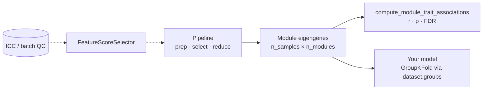

# Downstream Statistical Analysis

The reducer turns a wide feature matrix into a handful of **module eigengenes**.
This page shows how to take those eigengenes (and the reduction artifacts) into
statistical analysis: module–trait associations, QC-driven feature selection,
and leakage-safe modelling.



## Get labeled eigengenes

`WGCNAReducer.transform` returns a NumPy array. To carry the **sample index** and
**eigengene names** (`wgcna_0`, `wgcna_1`, …) into downstream stats, opt into
scikit-learn's pandas output:

```python
reducer = WGCNAReducer(soft_power="auto", min_module_size=20, store_tom=True)
reducer.set_output(transform="pandas")          # eigengenes come back as a DataFrame
eigengenes = reducer.fit_transform(X)            # index = samples, columns = wgcna_*
```

`set_output(transform="pandas")` works on the whole `Pipeline` too, so the final
step's output keeps its labels.

## Module–trait relationships

`compute_module_trait_associations` correlates each module eigengene with each
clinical trait and reports the coefficient, its p-value, and a
Benjamini-Hochberg FDR across the table — the standard WGCNA *module–trait
relationship*. Mixed-type traits are encoded automatically.

```python
from eigenradiomics import compute_module_trait_associations

mtr = compute_module_trait_associations(
    eigengenes,                      # samples × modules
    dataset,                         # a RadiomicsDataset (or a traits DataFrame)
    ["Age", "Stage", "Sex", "Event"],
    method="spearman",
)
mtr["r"]       # modules × traits correlation matrix
mtr["p"]       # matching p-values
mtr["p_fdr"]   # Benjamini-Hochberg FDR
```

`mtr["r"]` (with `mtr["p_fdr"]` for significance) is a compact summary linking the
reduced space to outcomes.

## Feature Hubness and Module Membership

To identify the central drivers representing each module's holistic co-expression score, use:
- **`compute_module_membership`**: Calculates Module Membership ($k_{\text{ME}}$) for every raw feature against the module eigengenes.
- **`identify_hub_features`**: Pinpoints the raw radiomic features that are the absolute most central "hubs" of their assigned modules.

```python
from eigenradiomics import compute_module_membership, identify_hub_features

# Calculate k_ME matrix (features x modules)
k_me = compute_module_membership(X, reducer=reducer)

# Find top hub feature representing each module
hubs_df = identify_hub_features(X, cluster_labels=reducer.get_reduction_artifacts().cluster_labels, reducer=reducer, top_n=1)
print(hubs_df)  # Columns: cluster, feature, k_ME, rank
```

You can plot this relationship dynamically and accessibly (complying with OUP science figure guidelines):

```python
from eigenradiomics.plotting import plot_hub_significance

# Plot k_ME vs. raw association strength
fig = plot_hub_significance(
    k_me, feature_significance=clinical_assoc,
    cluster_labels=reducer.get_reduction_artifacts().cluster_labels,
    target_cluster="blue",
    path="accessible_hub_plot.png"
)
```

## Radiomics Feature Group Over-Representation Analysis (ORA)

In multi-observer or multi-scale radiomics pipelines, checking if specific modules are clustered by extraction settings, observers, or shape vs. texture feature families is crucial. 
`compute_group_enrichment` performs a hypergeometric over-representation test (Fisher's Exact) and corrects for multiple testing.

```python
from eigenradiomics import compute_group_enrichment

# Map each feature key to custom observer or catalog groups
catalog_family = catalog.annotate(X).set_index("feature")["family"]

enrichment_df = compute_group_enrichment(
    cluster_labels=reducer.get_reduction_artifacts().cluster_labels,
    group_assignments=catalog_family
)
print(enrichment_df.head()) # Columns: cluster, group, n_overlap, p_value, fdr_q_value, odds_ratio
```

## Eigengene Profiles across Target Groups

To display the level or trajectory of module co-expression throughout disease progression or patient grades:

```python
from eigenradiomics.plotting import plot_eigengene_profiles

# Grouped Boxplot (with accessible hatching and strip overlay)
fig_box = plot_eigengene_profiles(eigengenes, dataset.data["Grade"], trait_name="Grade")

# Continuous Scatter (with regression fit line and Pearson r score annotation)
fig_scatter = plot_eigengene_profiles(eigengenes, dataset.data["SurvivalTime"], trait_name="Survival Days")
```

!!! tip "Per-feature outcome models"
    To model individual **features** (not module eigengenes) against an outcome —
    survival, binary, or continuous, with clinical adjustment and repeated-measures
    handling — and render volcano plots, see
    [Feature–outcome models & volcano plots](feature_models.md).

## QC-driven feature selection in a Pipeline

Reproducibility and batch QC run *outside* a single-`X` fit (they need multiple
readers / a batch label). Compute the scores once, then drop weak features inside
the pipeline with `FeatureScoreSelector` — so selection is part of the fitted,
leakage-safe transform:

```python
from eigenradiomics import compute_reproducibility, FeatureScoreSelector, WGCNAReducer
from sklearn.pipeline import Pipeline

repro = compute_reproducibility([reader1, reader2])          # per-feature ICC
icc = repro["ICC"]                                            # has 'feature' + 'icc_2_1'

pipe = Pipeline([
    ("prep", RadiomicsPrepTransformer().set_output(transform="pandas")),
    ("reliable", FeatureScoreSelector(icc, threshold=0.80, score_column="icc_2_1")),
    ("reduce", WGCNAReducer(soft_power="auto", min_module_size=20)),
]).set_output(transform="pandas")
```

The same selector drops **batch-confounded** features — pass a batch-effect size
column with `keep="below"` (keep features whose effect is small).

## Feeding eigengenes into a model (leakage-safe CV)

A `RadiomicsDataset` carries the target and the grouping needed for leakage-safe
cross-validation. Use `dataset.groups` (e.g. `PatientID`) with `GroupKFold` so no
patient appears in both train and test:

```python
from sklearn.model_selection import cross_val_score, GroupKFold
from sklearn.linear_model import LogisticRegression

X, y = dataset.to_pipeline_input()      # X = features, y from the study design
cv = GroupKFold(n_splits=5)
scores = cross_val_score(
    Pipeline([("reduce", WGCNAReducer(soft_power="auto", min_module_size=20)),
              ("clf", LogisticRegression())]),
    X, y, groups=dataset.groups, cv=cv,
)
```

Because the reducer fits its mapping on the training fold only and applies it to
the test fold, the reduction is part of the cross-validated estimate — not fit on
the whole cohort.

!!! note "Survival outcomes"
    A survival `StudyDesign` (`time` + `event`) makes `dataset.y()` return a
    `[time, event]` frame. eigenradiomics does not ship a survival model; hand the
    eigengenes + that frame to a Cox model (e.g. `lifelines` or
    `scikit-survival`), grouping by `dataset.groups` for validation.

See the [End-to-End Workflow](end_to_end.md) for the full pipeline in one script.
