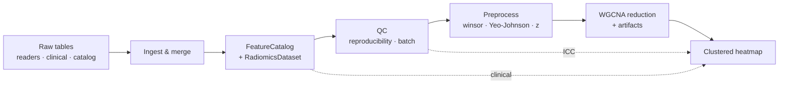
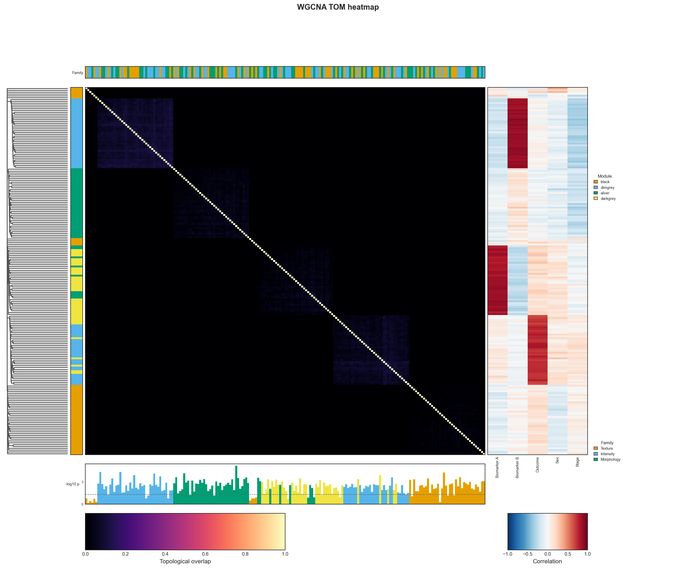

# End-to-End Workflow

This page wires **every eigenradiomics primitive into one pipeline**, from raw
tables to the cornerstone heatmap. Each step links to its dedicated guide for
the details; here we show how they fit together.



The complete, runnable version (with synthetic data generation) lives in
[`examples/end_to_end.py`](https://github.com/martonkolossvary/eigenradiomics/blob/main/examples/end_to_end.py):

```bash
poetry run python examples/end_to_end.py
```

## 1. Ingest: normalize IDs, drop duplicates, merge

Real clinical tables have stray whitespace in identifiers and the odd duplicate
row. [Normalize the key](data_ingestion.md#aligning-radiomics-with-clinical-data),
de-duplicate, then merge with a cardinality check that surfaces mismatches.

```python
from eigenradiomics import merge_tables, normalize_id_column, resolve_duplicates

clinical, _ = normalize_id_column(clinical_raw, "PatientID")
clinical, dup_report = resolve_duplicates(clinical, "PatientID", policy="first")
merge = merge_tables(
    radiomics, clinical, left_on="PatientID", right_on="PatientID",
    how="left", validate="1:1",
)
table = merge.merged          # joined features + clinical
merge.right_only              # clinical rows with no matching scan (diagnostic)
```

## 2. Catalog + dataset

Wrap the sidecar catalog and carry features, metadata, and the
[study design](data_ingestion.md#carrying-features-and-metadata-together)
together. The dataset hands a clean feature matrix to scikit-learn while keeping
`group` / `batch` / outcome columns for splitters and QC.

```python
from eigenradiomics import FeatureCatalog, RadiomicsDataset, StudyDesign

catalog = FeatureCatalog(catalog_table)
dataset = RadiomicsDataset(
    table,
    feature_columns=feature_cols,
    catalog=catalog,
    design=StudyDesign(roles={"group": "PatientID", "batch": "Center", "event": "Event"}),
)
```

## 3. Quality control

[Reproducibility](reproducibility.md) across two readers and
[batch effects](batch_effects.md) across centers — before any modelling.

```python
from eigenradiomics import (
    compute_reproducibility, plot_reproducibility_histograms,
    compute_batch_effects, plot_batch_effects,
)

repro = compute_reproducibility([reader1[feature_cols], reader2[feature_cols]])
plot_reproducibility_histograms(repro, "01_reproducibility.png")

batch = compute_batch_effects(dataset.features, dataset.metadata["Center"])
plot_batch_effects(batch, "02_batch_effects.png")

icc = repro["ICC"].set_index("feature")["icc_2_1"]   # reused as a heatmap track below
```


## 4. Preprocess

[Winsorize → Yeo-Johnson → z-score](radiomics_preprocessing.md), all behind the
standard `fit_transform` so it drops into a `Pipeline` unchanged.

```python
from eigenradiomics import RadiomicsPrepTransformer

X = RadiomicsPrepTransformer().fit_transform(dataset.features)
```

## 5. Reduce with WGCNA

Group co-varying features into [modules](../reducers/wgcna.md) and project to one
eigengene each. `store_tom=True` keeps the similarity matrix so the heatmap can
draw it; `get_reduction_artifacts()` returns the
[structured artifacts](../reducers/index.md#reduction-artifacts) (similarity,
linkage, module labels, ordering) every plot consumes.

```python
from eigenradiomics import WGCNAReducer

reducer = WGCNAReducer(soft_power="auto", min_module_size=10, store_tom=True)
eigengenes = reducer.fit_transform(X)            # samples × modules
artifacts = reducer.get_reduction_artifacts()
```

## 6. Clinical correlations

Associate each feature with the clinical variables for the right-hand panel
(mixed types are encoded and rank-correlated; see
[the heatmap guide](clustered_heatmap.md#right-correlation-panel)).

```python
from eigenradiomics import compute_clinical_correlations

corr = compute_clinical_correlations(
    X, dataset.metadata[["Age", "Biomarker", "Sex", "Stage", "Event"]],
)
```

## 7. The cornerstone heatmap

Everything converges here. The reducer's artifacts supply the similarity,
dendrogram, modules, and ordering; the catalog supplies the family strip; QC
supplies the reproducibility bar; and the clinical correlations supply the right
panel.

```python
from eigenradiomics import Bar, plot_clustered_heatmap

families = catalog.frame.set_index("feature")["family_group"].reindex(names)
families.name = "Family"

fig = plot_clustered_heatmap(
    artifacts,                                              # similarity · linkage · modules
    top=[families],                                         # catalog family-group strip
    bottom=[Bar(icc.reindex(names), title="ICC", reference=0.80)],  # reproducibility
    right=corr,                                             # feature × clinical correlations
    cmap="magma", vmin=0.0, vmax=1.0, below_cutoff_color="#050505",
    colorbar_label="Topological overlap",
)
```



Each side answers a question — *who?* (left dendrogram + modules), *what kind?*
(top family strip), *how much?* (bottom reproducibility bar), *related to what?*
(right clinical panel) — around the similarity itself. From here, the module
eigengenes (`eigengenes`) feed any downstream model with the leakage-safe
`dataset.groups` for cross-validation.
