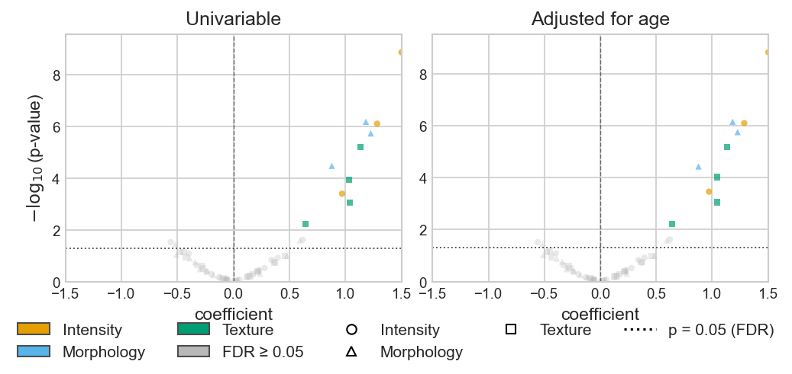

# Feature–Outcome Models & Volcano Plots

`compute_feature_associations` models **each feature against an outcome** — with
optional clinical adjustment and repeated-measures handling — and returns a tidy
table of effects, confidence intervals, p-values, and FDR. `plot_volcano`
visualizes it, and the result feeds the [clustered heatmap](clustered_heatmap.md)
and an Excel report.

!!! note "Optional dependencies"
    Survival (Cox) needs `lifelines`; binary and mixed models need `statsmodels`.
    Install them with the extras: `pip install "eigenradiomics[survival,modeling]"`.
    Continuous OLS+HC3 needs neither.

## Fit the models

The outcome type is inferred (a `[time, event]` frame → survival, ≤2 unique values
→ binary, else continuous) or set explicitly. Model **tiers** are fitted in
parallel — typically a univariable tier and one or more clinically-adjusted tiers:

```python
from eigenradiomics import compute_feature_associations

result = compute_feature_associations(
    X,                                  # samples × features (or a RadiomicsDataset)
    outcome,                            # Series / [time,event] frame / column name
    model_tiers={"Univariable": [], "Adjusted": ["age", "sex"]},
    covariate_data=clinical,            # where the covariate columns live
    catalog=catalog,                    # adds family / family_group annotation
)
result.table        # one row per (tier, feature): effect, CI, p, p_fdr, n, status
result.top_hits(mode="fdr")            # FDR-significant rows, per tier
```

Effects are the **HR** (survival), **OR** (binary), or **β** (continuous), each
with its confidence interval; survival rows also carry the **c-index**. The fit
`status` records non-fits (`no_events`, `constant_feature`, `fit_failed`, …).

## Mixed / repeated-measures models

Pass `groups` (a cluster identifier — e.g. patient ID for per-lesion data) and the
engine switches to a mixed/clustered variant: **MixedLM** (continuous), a
random-intercept **GLMM** or cluster-robust **GEE** (binary, via `mixed_method=`),
and **cluster-robust Cox** (survival).

```python
result = compute_feature_associations(
    X, outcome, groups="PatientID", covariate_data=clinical,
)
```

With a `RadiomicsDataset`, the outcome (`StudyDesign` time/event/target), `groups`
(design group), and catalog are taken from the dataset automatically:
`compute_feature_associations(dataset)`.

## Volcano plots (1 → 3×3)

`plot_volcano` draws one panel per model tier; the grid is chosen from the panel
count (1→1×1, 2→1×2, 3→1×3, 4→2×2, 5–9→3×3) or set with `layout=(rows, cols)`.
FDR-significant points are coloured (Okabe-Ito) by a catalog column; an
outlier-aware x-axis keeps one extreme effect from flattening a panel.

```python
from eigenradiomics import plot_volcano

fig = plot_volcano(result, color_by="family_group", marker_by="family_group")
```



## Feed the heatmap & export

The per-feature statistics that drive the volcano also annotate the
[cornerstone heatmap](clustered_heatmap.md) and export to Excel:

```python
# a -log10(p) bottom track for the clustered heatmap
bar = result.bar(tier="Adjusted", value="neg_log10_p", reference=-np.log10(0.05))
plot_clustered_heatmap(artifacts, bottom=[bar])

# a feature × tier effect matrix for the right correlation panel
panel = result.matrix(value="log2_effect")

# a styled workbook (all results + a top-hits sheet)
result.to_excel("feature_models.xlsx")
```

See the [API reference](../api/feature_models.md) for the full signatures.
