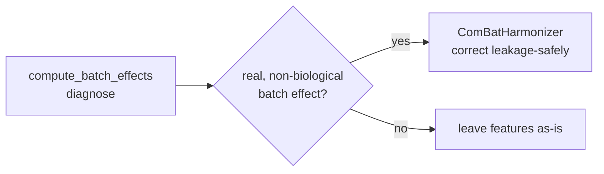

# Harmonize Batch Effects (ComBat)

Once [batch-effect diagnostics](batch_effects.md) show a real, non-biological
center/scanner effect, `ComBatHarmonizer` removes it. Unlike running ComBat on a
whole cohort, the harmonizer estimates the correction on the **training** data and
replays it on new data, so it is **leakage-safe** inside a `Pipeline` and
cross-validation.

!!! note "Optional dependency"
    `ComBatHarmonizer` builds on [`inmoose`](https://inmoose.readthedocs.io/).
    Install it with the `combat` extra: `pip install "eigenradiomics[combat]"`.

## Basic usage

`batch` is per-sample batch labels (e.g. scanner/center); features that are
constant in the training data are passed through unchanged.

```python
from eigenradiomics import ComBatHarmonizer

harmonizer = ComBatHarmonizer()
X_train_h = harmonizer.fit_transform(X_train, batch=batch_train)
X_test_h = harmonizer.transform(X_test, batch=batch_test)   # corrected with train parameters
```

Samples whose batch was **seen during `fit`** are corrected with the stored
per-batch parameters. A batch unseen at fit is, by default, passed through with a
warning (`on_unseen_batch="error"` to raise instead). A `reference_batch` is left
unchanged.

## Preserving biological signal (covariates)

Pass `covariates` — a **numeric** model matrix (encode categoricals first, e.g.
with [`encode_clinical_series`](downstream_analysis.md)) — to protect biological
variation from being removed along with the batch effect:

```python
import pandas as pd

covariates = pd.DataFrame({"is_tumour": tumour_flag.astype(float)})
harmonizer.fit(X_train, batch=batch_train, covariates=covariates_train)
```

## In a leakage-safe Pipeline

`batch` (and `covariates`) are sample-aligned metadata, not features. Use
scikit-learn [metadata routing](https://scikit-learn.org/stable/metadata_routing.html)
so they flow through a `Pipeline` and cross-validation, with the correction fit
per training fold:

```python
import sklearn
from sklearn.pipeline import Pipeline
from eigenradiomics import ComBatHarmonizer, RadiomicsPrepTransformer, WGCNAReducer

sklearn.set_config(enable_metadata_routing=True)

harmonizer = ComBatHarmonizer()
harmonizer.set_fit_request(batch=True).set_transform_request(batch=True)

pipe = Pipeline([
    ("prep", RadiomicsPrepTransformer().set_output(transform="pandas")),
    ("harmonize", harmonizer),
    ("reduce", WGCNAReducer(soft_power="auto", min_module_size=20)),
])
pipe.fit(X_train, batch=batch_train)        # batch routed to the harmonizer's fit
```

## Diagnose, then correct

ComBat correction should follow evidence, not be applied by default — see the
[Best Practices](best_practices.md#qc-choices). The typical loop is:


