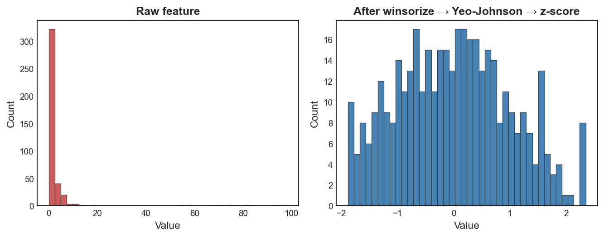

# Radiomics Table Preprocessing

`eigenradiomics.preprocessing` provides utilities for splitting selected
Pictologics wide-format feature columns out of a radiomics table before
downstream modeling or reduction.

Pictologics wide tables use feature columns named as:

```text
{config}__{feature_key}
```

For example:

```text
standard_fbn_32__volume_RNU0
standard_fbn_32__joint_entropy_TU9B
```

Columns that do not follow this pattern are treated as metadata by default.

## Split a CSV Table

```python
from eigenradiomics.preprocessing import split_radiomics_file

result = split_radiomics_file(
    "pictologics_features.csv",
    "preprocessed/",
    features=["volume_RNU0"],
)

print(result.stripped_table)
print(result.removed_table)
```

This writes a stripped radiomics table without the selected feature columns and
a removed-feature table containing metadata columns plus the removed features.

## Selector Types

`features` accepts exact feature keys, full column names, and `*` wildcards:

```python
features="volume_RNU0"                    # all configs
features="standard_fbn_32__volume_RNU0"   # one config-feature pair
features="standard_fbn_*__volume_RNU0"    # matching configs
```

`configs` is a global filter over configuration names:

```python
split_radiomics_file(
    "pictologics_features.csv",
    "preprocessed/",
    features="volume_RNU0",
    configs="standard_fbn_*",
)
```

## Catalog-Backed Selection

If you provide a Pictologics `describe_features()` catalog, you can select by
granular family or broad family group:

```python
split_radiomics_file(
    "pictologics_features.csv",
    "preprocessed/",
    catalog="feature_catalog.csv",
    family_groups="Texture",
)
```

The catalog should contain `config`, `feature_key`, `family`, and
`family_group` columns. A legacy single `feature` column is also supported when
it contains `{config}__{feature_key}` values.

## sklearn Pipeline Use

`RadiomicsFeatureRemover` is a scikit-learn-compatible transformer. Use it when
the removal should be part of a fitted preprocessing pipeline:

```python
from sklearn.pipeline import Pipeline
from sklearn.preprocessing import StandardScaler

from eigenradiomics import RadiomicsFeatureRemover, WGCNAReducer

pipe = Pipeline(
    [
        ("remove", RadiomicsFeatureRemover(features="volume_RNU0")),
        ("scale", StandardScaler()),
        ("reduce", WGCNAReducer(soft_power=6, min_module_size=30)),
    ]
)
```

Like the reducers, the transformer validates that DataFrame columns at
`transform` time match the columns seen during `fit`.

## Per-Feature Cleaning with `RadiomicsPrepTransformer`

`RadiomicsPrepTransformer` is a scikit-learn-compatible transformer that
cleans each feature column independently while **preserving NaN values**
(standard sklearn transformers often fail or propagate NaN across a row). For
every column it applies, in order:

1. **Winsorization** — clip values to the `winsor_lower` / `winsor_upper`
   quantiles (defaults 0.01 / 0.99) to tame extreme outliers.
2. **Yeo-Johnson** power transform — reduce skew (skip with
   `skip_yeo_johnson=True`; constant columns are passed through unchanged).
3. **Standardization** — z-score to zero mean / unit variance (disable with
   `standardize=False`).

```python
from eigenradiomics.preprocessing import RadiomicsPrepTransformer

prep = RadiomicsPrepTransformer(winsor_lower=0.01, winsor_upper=0.99)
X_clean = prep.fit_transform(X)  # NaNs in X stay NaN in X_clean
```

A right-skewed, outlier-laden feature becomes approximately normal and centered,
while missing values pass straight through:



!!! tip "Order matters"
    Winsorization caps outliers *before* the Yeo-Johnson fit, so a handful of
    extreme values can't dominate the power-transform parameter. Constant columns
    are detected and passed through unchanged rather than erroring.

The fitted parameters (per-column winsor bounds, power transform, and scaling)
are stored, so `transform` applies exactly the same cleaning to unseen data. As
with the reducers, feature names and order are checked at `transform` time, so a
re-ordered or mismatched table is rejected rather than silently mis-cleaned. A
DataFrame input returns a DataFrame (preserving the index and columns); an
array input returns an array.

It is the default preprocessing step inside `compute_batch_effects`, and works
as a normal step in an sklearn `Pipeline`.
