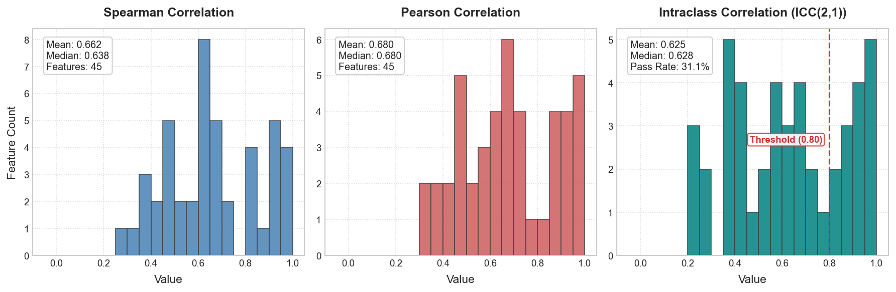

# Radiomics Feature Reproducibility Analysis

Evaluating the robustness and reproducibility of machine learning features across different observers, readers, or software settings is a fundamental step in high-dimensional radiomics pipelines. Non-reproducible features can introduce substantial noise and bias, and should be excluded early in the modeling process.

`eigenradiomics` provides a reproducibility framework with quality control (QC), multiple-rater statistics (ICC(2,1) and Spearman/Pearson), formatted Excel reports, and accessible figures.

---

## How the pieces fit together

One compute step produces a results dictionary that every plotter and the Excel
exporter consume. The functions work **standalone or together**, on Pictologics
data or plain DataFrames/ndarrays.

```text
datasets: [Reader 1, Reader 2, ...]        (DataFrames or ndarrays; min 2)
        │
        │  resolve feature columns  (all numeric by default, or a features= list /
        │                            Pictologics catalog selector)
        │  per feature → (N subjects × K observers) matrix,
        │  drop rows with any NaN   (per-feature complete-case)
        ▼
┌───────────────────────────┐
│  compute_reproducibility   │
└───────────────────────────┘
        │
   dict { "Spearman", "Pearson", "ICC" }
     ├─ ICC : icc_2_1, ci95_low/high, p_value, p_fdr, ms_*, primary_icc_pass
     │        └ _icc_2_1_estimate (point) + _bootstrap_icc_ci → _icc_2_1_batch (CI)
     ├─ K=2 : estimate, ci95_low/high, p_value, p_fdr        (Spearman/Pearson, _fisher_ci)
     └─ K≥3 : mean, median, sd, q25, q75, min, max           (pairwise; mean pooled
              in Fisher z-space via _fisher_mean — no p-value: pairs aren't independent)
        │
  ┌─────┴───────────────────────┬─────────────────────────────────┐
  ▼                             ▼                                 ▼
plot_reproducibility_histograms  plot_reproducibility_synteny   plot_reproducibility
  (Spearman/Pearson/ICC            (per-feature metric ribbon       (wrapper: compute_kws →
   distributions)                   between two observer axes)        compute, synteny_kws →
                                                                      synteny; both layouts)
```

The cluster-robust ICC bootstrap (`groups=`) engages automatically on a
MultiIndex (e.g. repeated measures such as Pictologics per-mask rows, clustered
by patient) or with an explicit `groups=` column/level/array. The ICC `p_value`
tests whether subjects are distinguishable (an F-test) — **not** whether the ICC
clears a threshold — so judge reliability from the ICC estimate and its CI versus
`primary_threshold`. The ICC is the principled inferential statistic for K ≥ 3.

---

## Why ICC(2,1)?

The framework implements the **two-way random-effects, absolute-agreement, single-measure Intraclass Correlation Coefficient (ICC(2,1))** (McGraw & Wong, 1996; Shrout & Fleiss, 1979). 

* **Generalizability**: By modeling both the subjects (patients) and the observers (readers/settings) as random effects, the reliability coefficients generalize beyond the specific raters in the study to the broader population.
* **Absolute Agreement**: Standardizes absolute measurements rather than just relative ranks (which is critical in clinical imaging).
* **Multi-Observer Support**: The underlying ANOVA Mean Squares formulation natively handles any $K \ge 2$ observers concurrently.
* **Deterministic Bootstrapping**: Computes 95% Confidence Intervals deterministically via feature-name-keyed seed hashing (using BLAKE2b) to guarantee 100% reproducible results across platforms.

---

## Quality Control (QC) & Auto-Alignment

 Mismatched row orders (subjects) or column orders (features) across datasets can lead to catastrophic, silent statistical errors. `eigenradiomics` implements a strict validation layer:

1. **Name-Based Matching (Named DataFrames)**:
   * Asserts that all input DataFrames share the exact same sets of column names and row indices.
   * If any features or subjects are missing or unexpected across datasets, a detailed `ValueError` is raised (detailing the first 5 mismatched items).
   * If the columns or rows match exactly but are out of order, the framework **automatically reorders** them to align perfectly with the first dataset's layout.
2. **Positional Matching (Arrays / RangeIndexes)**:
   * Fallback for numpy arrays or RangeIndex DataFrames. Asserts that all datasets share identical shapes and aligns columns by positional indexes.

---

## 2-Observer Studies ($K = 2$)

For studies comparing exactly two readers, the framework reports detailed correlation metrics for every analyzed feature:
* **Spearman's $\rho$ and Pearson's $r$**: Correlation estimates.
* **95% Confidence Intervals**: Fisher-transformed confidence intervals — Pearson uses $1/\sqrt{n-3}$; Spearman uses the Bonett-Wright (2000) variance $\sqrt{(1 + \rho^2/2)/(n-3)}$.
* **Multiple Testing Correction**: Raw $p$-values and FDR-corrected $p$-values (Benjamini-Hochberg procedure).

```python
import pandas as pd
from eigenradiomics import compute_reproducibility

# Reader 1 and Reader 2 feature DataFrames
df_reader1 = pd.read_csv("reader1_features.csv", index_col="PatientID")
df_reader2 = pd.read_csv("reader2_features.csv", index_col="PatientID")

# Calculate reproducibility
results = compute_reproducibility(
    datasets=[df_reader1, df_reader2],
    bootstrap_iterations=1000,
    primary_threshold=0.80
)

# results is a dictionary containing Spearman, Pearson, and ICC DataFrames
print(results["ICC"].head())
print(results["Spearman"].head())
```

---

## Multi-Observer Studies ($K > 2$)

When comparing three or more observers/settings, reporting a single correlation between two readers is insufficient. For $K > 2$, the framework computes all $\binom{K}{2}$ pairwise combinations and compiles aggregate statistics for the Spearman and Pearson sheets:
* **mean**: Arithmetic mean of pairwise correlations.
* **median**: Median of pairwise correlations.
* **sd**: Standard deviation of pairwise correlations (capturing observer consensus).
* **q25, q75**: 25th and 75th percentiles.
* **min, max**: Minimum and maximum pairwise correlations.

The ICC sheet computes the unified $n \times K$ table Intraclass Correlation Coefficient.

```python
# 3 different readers
results = compute_reproducibility(
    datasets=[df_reader1, df_reader2, df_reader3],
    bootstrap_iterations=1000
)

# View Spearman aggregate metrics across the rater pairs
print(results["Spearman"][["feature", "mean", "sd", "min", "max"]].head())
```

---

## Feature Selection

Restrict the analysis to a subset of features in two ways.

**Explicit column list — works on any DataFrame.** Pass `features=` a list of
column names that exist in your data. The names are used directly, so generic
(non-Pictologics) DataFrames can be subset without any catalog:

```python
results = compute_reproducibility(
    datasets=[df_reader1, df_reader2],
    features=["shape_volume", "firstorder_energy", "glcm_contrast"],
)
```

**Pictologics catalog selectors.** `configs`, `families`, `family_groups` (and
name *patterns* passed to `features`) resolve through `RadiomicsFeatureRemover`
and therefore require Pictologics-style column names / a `FeatureCatalog`:

```python
# Only GLCM/GLRLM families from the "original" config
results = compute_reproducibility(
    datasets=[df_reader1, df_reader2],
    families=["GLCM", "GLRLM"],
    configs="original",
    catalog=catalog,
)
```

With no selector, every **numeric** column is analysed.

---

## Excel Reports

Export the results dictionary to a formatted Excel workbook, which applies:
* **Frozen headers (`A2`)** and **auto-filters** on all sheets (`Spearman`, `Pearson`, `ICC`).
* **Auto-fit column widths** with padding to prevent cropped values.
* **Styled header rows**.
* **Decimal formatting** (3 d.p. for coefficients, 4 d.p./scientific notation for $p$-values).

```python
from eigenradiomics import write_reproducibility_excel

write_reproducibility_excel(results, "reproducibility_report.xlsx")
```

---

## Accessible Histograms

Visualize metric distributions with accessible styling (high-contrast colours, dark bar outlines, direct labelling, sans-serif type):

```python
from eigenradiomics import plot_reproducibility_histograms

fig = plot_reproducibility_histograms(
    results,
    path="reproducibility_distributions.png",
    primary_threshold=0.80
)
```

The figure shows the Spearman, Pearson, and ICC(2,1) distributions across
features, each with summary statistics and the retention threshold:



!!! tip "Choosing a threshold"
    A common convention treats ICC ≥ 0.75 as *good* and ≥ 0.90 as *excellent*
    reliability. The `primary_threshold` is what populates the `primary_icc_pass`
    flag (`ICC(2,1) >= threshold`) on the ICC sheet — pick it to match your
    study's tolerance, then drop the features that fall below it before modeling
    (see the pipeline example below).

**Accessibility and Design features**:
* **Color Independence**: High-contrast, colorblind-friendly colors (Steel Blue, Indian Red, Muted Teal) assigned to each metric.
* **Dark Outlines**: Distinct outlines around histogram bars (`edgecolor='0.25'`) to ensure a contrast ratio $> 3:1$ against the background.
* **Direct Labeling**: The 0.80 cutoff threshold line is directly labeled with a contrasting bounding box, avoiding convoluted legends.
* **Sans-serif Typography**: Uses clear sans-serif typography (Arial/Helvetica) sized between 10 pt and 12 pt for reading accessibility.

---

## Unified Analysis and Combined Visualization

Instead of calling the calculation, excel export, and individual plotting functions separately, `eigenradiomics` provides a unified wrapper function `plot_reproducibility`.

This function:
1. Performs the statistical calculations (`compute_reproducibility`).
2. Optionally exports results to an Excel workbook (`excel_path`) and CSV files (`csv_dir`).
3. Generates a publication-ready multi-panel figure containing the metric histograms on top and the landscape synteny plot on the bottom.
4. Auto-labels the subfigures as **A**, **B**, **C**, **D**... dynamically based on the calculated sheets.
5. Saves the combined figure in multiple formats (PNG, PDF, TIFF) with customizable DPI resolution.

```python
from eigenradiomics import plot_reproducibility

results, fig = plot_reproducibility(
    datasets=[df_reader1, df_reader2],
    catalog=catalog,
    path="combined_reproducibility.png",
    excel_path="reproducibility_report.xlsx",
    primary_threshold=0.80,
    synteny_kws={"observer_labels": ["Diastolic", "Systolic"]},
    save_pdf=True,
    save_tiff=True,
    dpi=400
)
```

---

## End-to-End scikit-learn Pipeline Integration

A standard workflow consists of running a reproducibility analysis, identifying features that fail to meet a reliability threshold (e.g. $ICC < 0.80$), and excluding them before downstream training:

```python
from sklearn.pipeline import Pipeline
from sklearn.preprocessing import StandardScaler
from eigenradiomics import RadiomicsFeatureRemover, WGCNAReducer, compute_reproducibility

# 1. Run reproducibility analysis
results = compute_reproducibility([df_reader1, df_reader2])
icc_df = results["ICC"]

# 2. Identify non-reproducible features. Features whose ICC could not be
#    estimated (NaN, e.g. too few paired samples) are treated as
#    non-reproducible here via fillna(0.0); drop the fillna to keep them.
icc_values = icc_df["icc_2_1"].fillna(0.0)
non_reproducible = icc_df.loc[icc_values < 0.80, "feature"].tolist()

# 3. Feed non-reproducible features to RadiomicsFeatureRemover in a pipeline
pipeline = Pipeline([
    ("exclude_non_reproducible", RadiomicsFeatureRemover(features=non_reproducible)),
    ("scale", StandardScaler()),
    ("reduce", WGCNAReducer(soft_power=6, min_module_size=30))
])

# Fit and transform training data safely
X_train_clean = pipeline.fit_transform(df_reader1)
```
